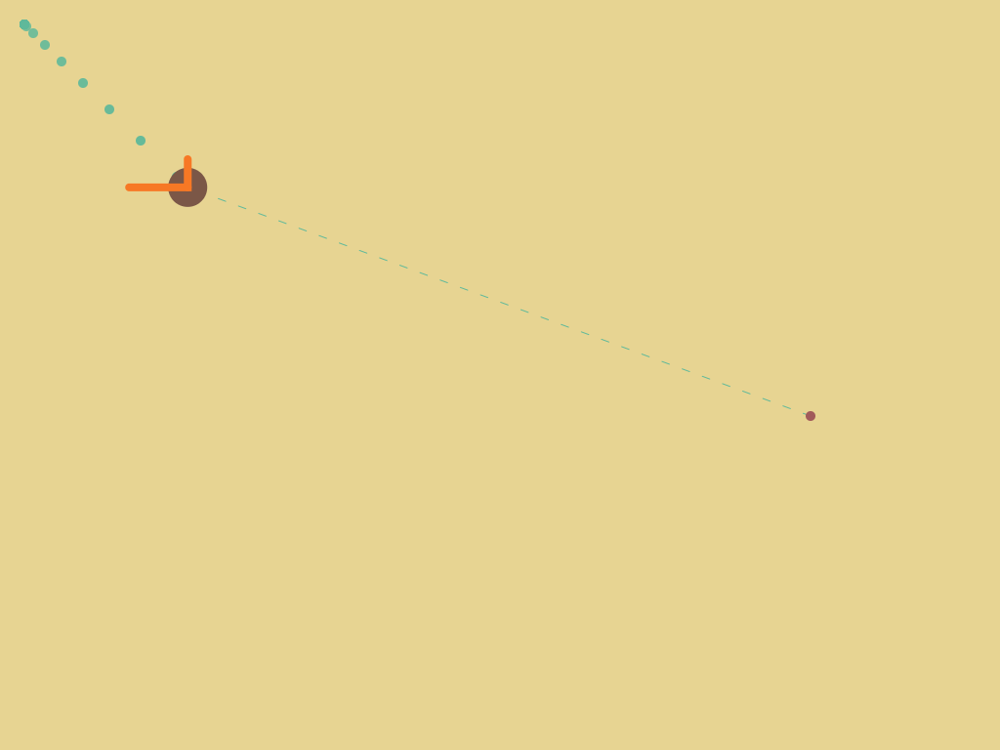

# Ball control

The BallControl demo shows how a feedback system is created and applied in a simple, reactive setup.
The system under control is the position of a ball. Given its current position it has to move to the
position indicated by the user. To do so, we take the difference between the *current position* and
the *desired position*. Using a [PID-controller] this *error* in transformed in a new *acceleration*.
By integrating twice (*acceleration* to *velocity* to *position*) we get the ball's next position.
Repeating this process using a feedback system ultimately brings the ball to a halt at the desired
position.

[PID-controller]: http://rvanheest.github.io/Literature-Study-Feedback-Control/Controllers.html#pid-control

